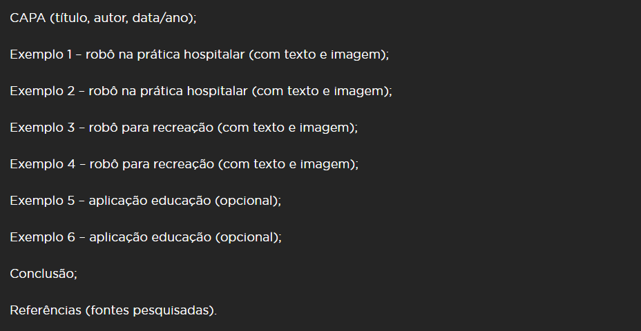

# Atividade

- ### Desafio

  - Então, eis seu desafio a partir de agora: pensar na melhor solução para a recreação de crianças hospitalizadas, usando um robô que interage com essas crianças por meio de alguma aplicação.

- ### Atividade

  - #### Primeira Parte

  - Criar uma apresentação em slides com no mínimo dois exemplos de uso geral de tecnologias na área da saúde, voltadas especificamente para auxiliar na prática hospitalar, com o objetivo de oferecer bem-estar aos pacientes, sejam eles adultos ou crianças.

  - #### **Segunda Parte**

    - Pesquisar dois exemplos de aplicação de robôs para recreação de crianças em diversos contextos

  - #### **Terceira Parte**

    - Pesquisar por duas aplicações, WEB ou APP, destinadas ao público de 5 a 7 anos, sendo um recreativo e o outro educacional

  - #### **Para finalizar**

    - Quando concluir a apresentação, responda, em um texto unico de um ou dois parágrafos as perguntas a seguir
    - O que merece ser destacado do que foi pesquisado?
    - Que aprendizado pode ser tirado desta pesquisa para o projeto FriendBot?

  - #### **Atenção:**

    - Todos os exemplos selecionados por você devem ter sido realmente utilizados (aplicação efetiva), além de publicados em algum veículo de mídia (site, revista, jornal etc.). Sua apresentação deve ter nove slides. Por isso, atente-se para a quantidade de texto por slide, como segue:

  - No total sua apresentação apresentará seis exemplos envolvendo saúde, tecnologia e o universo infantil

    

  - Ao montar sua apresentação lembre se de mencionar as informações relevantes sobre cada exemplo escolhido por você, bem como mencione o país de origem, instituição promotora, se houver e ano, se houver