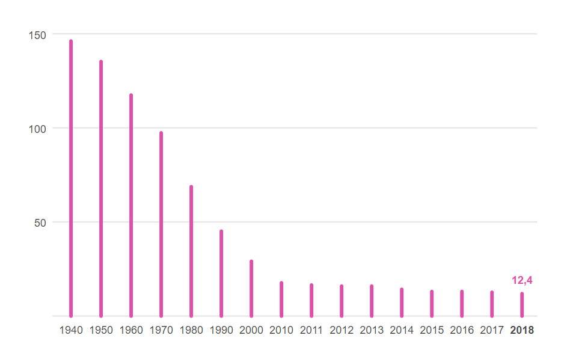
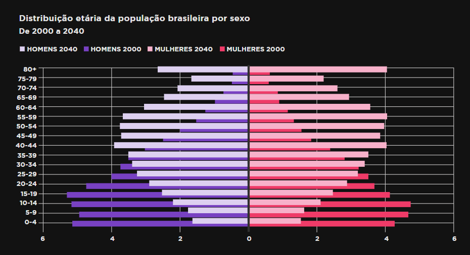
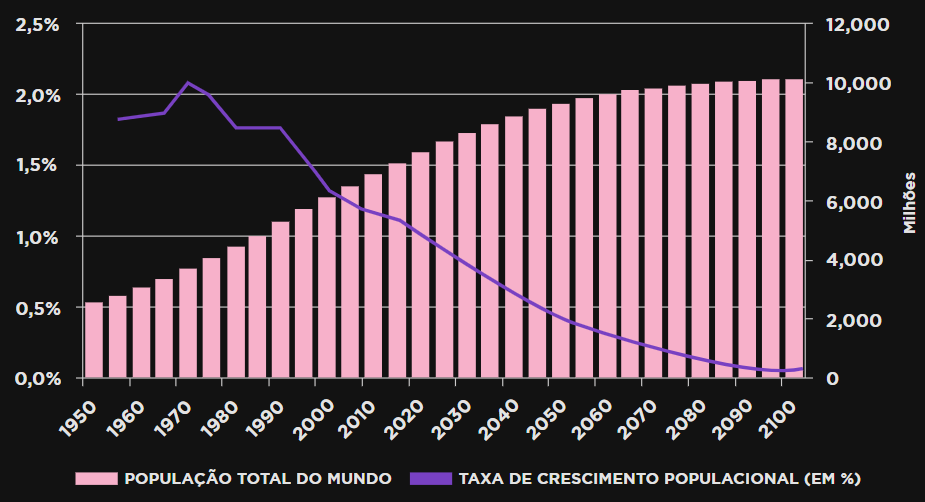
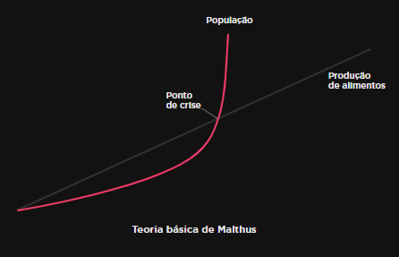
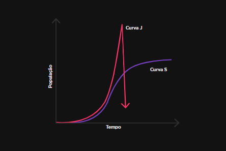
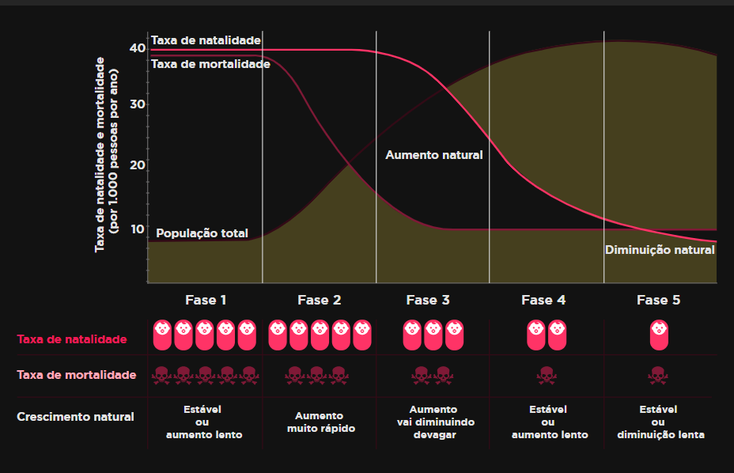

# Capitulo 2

### *Humanidade e Sustentabilidade em Foco*

- ###  Crescimento Populacional de Maneira Sustentável

  - Não a duvidas que iremos viver mais que nossos pais e avós. Com isso, teremos uma vida útil maior, logo, também iremos trabalhar mais.

  - Para isso precisamos envelhecer de maneira mais sustentável possível

    - #### Sustentabilidade

      - Sustentabilidade significa de forma resumida, preservar

      - Muito associada ao meio ambiente.

      - A sustentabilidade é a melhor alternativa para o ser humano de continuar a se desenvolver e evoluir, satisfazendo suas necessidades, sem comprometer gerações futuras

      - A sustentabilidade é complexa pois possui 3 pilares que devem ser considerados 

        - #### Questão Social

          - O ser humano deve se respeitar em primeiro lugar, assim será possível respeitar a natureza, já que ele próprio faz parte do meio ambiente

        - #### Questão energética

          - A economia só existe graças a energia, sem economia, não existira desenvolvimento e logo as condições de vida se deterioram
          - Logo a energia precisa ser gerada

        - Questão Ambiental

          - O meio ambiente deve ser preservado para que o ser humano sobreviva, e a economia se desenvolva

        - Assim, reduzir a emissão de carbono e utilizar energia limpa, são algumas formas de mantermos o lazer já proporcionado e reduzirmos o impacto que é exercido sobre o meio ambiente
  
- ### Sustentabilidade X Crescimento Populacional

  - A maior preocupação com a sustentabilidade esta totalmente conectada ao crescimento populacional

  - #### Alguns Dados e Tendências

    - Ao estudarmos o crescimento populacional, podemos abstrair dados que ajudam a realizar projeções e tirar conclusões sobre o futuro

    - A primeira conclusão é que diferentes povos aumentam sua população de forma diferente

      - Um pais como a etiópia, por exemplo, tinha a media de idade de 18 anos, 43% tinha menos de 15
      - Na Alemanha, por outro lado, a media era de 46 anos, e apenas 13% tinha menos de 15
      - Com esses dados podemos concluir que o crescimento populacional da etiópia é de 2.7% enquanto da Alemanha é negativo, com 0.1%
      - Essa mesma porcentagem aparece em países subdesenvolvidos 

    - Existem vários fatores para que na Alemanha o resultado tenha sido tão diferente

      - Mais acesso a informação
      - Métodos contraceptivos
      - E o custo de vida mais alto

    - Por outro lado, na etiópia, taxas de mortalidade infantil altas, aumenta a taxa de natalidade, pois as famílias procuram maximizar as chances de que seus filhos atinjam a fase adulta

    - #### E no Brasil?

      - #### Mortalidade Infantil

      - 

      - No brasil podemos ver um meio termo entre países da Europa e África

      - Atualmente se encontra mais próximo da situação alemã, porem ja foi mais parecido com a nação Africana

      - #### Natalidade

        - A natalidade cai ano a ano no brasil
        - Isso se da a mudanças no crescimento econômico que o brasil experimentou nas últimas décadas foras os fatores já citados como métodos contraceptivos.
        - Atribui-se também a maior presenças das mulheres no mercado de trabalho

      

    - É notável que em 2000 o gráfico toma forma de pirâmide, assemelha-se com países menos desenvolvidos.

    - Enquanto em 2040 ela toma forma de um peão, parecido com países mais desenvolvidos

    - #### Existe Limite para o nosso crescimento?

      

      - Embora se observe uma queda na taxa de crescimento populacional, que hoje no brasil se encontra em 1%, se continuarmos neste patamar, a população ira dobrar a cada 70 anos
      - Essa ideia já era compartilhada lá em 1798 por Thomas Malthus
        - Ele acreditava que a população crescia de forma exponencial, enquanto a agricultura crescia de forma aritmética
        - Percebe-se então que em algum momento iria faltar alimento para a população
        - Com isso foi decretada a **catástrofe malthusiana** no qual a fome resultaria em guerras e doenças, levando a humanidade ao colapso 
        - 
        - **Thomas Malthus** foi "Refutado" quando teve inicio a primeira revolução industrial e logo depois a segunda
        - Essas revoluções foram essenciais para que o crescimento dos alimentos produzidos crescesse muito e a quantidade de filhos fosse reduzido um pouco
        - Por isso avanços tecnológicos tem aumentado ainda mais nossa capacidade de produção de alimento, refutando ainda mais **Malthus**
      - Existe um consenso que a população mundial não pode continuar crescendo indefinidamente
      - **Capacidade de Carga** é o nome dado a quantidade de indivíduos que o ambiente consegue suportar sem ter um impacto negativo significativo para ambos
      - 
      - A duvida que persiste é se a população vai continuar a crescer exponencialmente, gerando o colapso previsto por **Malthus**, como representado na linha J
      - Ou encontraremos um equilíbrio e assim mantendo a população em um limite, como representa a linha S
      - Atualmente gráficos do crescimento populacional apontam que estamos crescendo da forma J especialistas defendem se tornara uma curva S, e esse equilíbrio pode ser visto no modelo proposto por **Warren Thompson** em 1929
      - 
          - Podemos nos considerar na terceira fase
        - Países desenvolvidos como a Alemanha se encontra até mesmo no quarta fase
          - Enquanto países subdesenvolvidos e alguns em desenvolvimento como a índia se encontra na segunda fase
          - Nos estagio 4 e 5 se encontra um equilíbrio ou até mesmo uma leve queda populacional
  
- ### Educação Ambiental

  - Promover a educação ambiental tem sido a iniciativa de diversos países com o objetivo de conscientizar a população sobre o meio ambientes e sustentabilidade

  - #### Alguns programas de Educação Ambiental

    - #### PNUMA

      - Após uma conferencia em Estocolmo em 1972, a Educação Ambiental recebeu atenção de fóruns e nações o que deu origem ao **Programa das nações unidas para o Meio Ambiente**

    - #### PIEA

      - Ao mesmo tempo que o PNUMA, junto com a Unesco, foi criando também **Programa Internacional de Educação Ambiental** com o intuito de promover o intercâmbio de ideias entra as nações do mundo sobre o tema.

    - Em uma das oportunidades de intercâmbio de ideias, no Seminário internacional sobre Educação Ambiental, em 1975, foi aprovada a Carta de Belgrado

    - #### Carta de Belgrado

      - Documento que aborda alguns tópicos sobre Educação Ambiental com a ideia de desenvolvimento sustentável

      - Alguns dos objetivos são:

      - #### Conscientização

        - Contribuir para que integrantes da educação formal (professores e alunos) e informal, adquiram consciência e sensibilidade em relação ao meio ambiente em geral, assim como os problemas relacionados a ele

      - #### Conhecimento

        - Promover a compreensão básica do meio ambiente, especificamente com relação entre ser humano e o ambiente.

      - #### Participação

        - Desenvolver o senso de urgência e responsabilidade em grupos, sobre às questões ambientais

      - #### Atitudes
      
        - Motivar a participação ativa na proteção ao meio ambiente e incentivar ideias que resolvam problemas ambientais
      
      - #### Habilidades
      
        - Proporcionar condições para que grupos adquiram habilidades necessárias a essas participações
      
      - #### Capacidade de Avaliação
      
        - Estimular a avaliação de providências e programas de educação ambiental
  
- ### A energia é fundamental!

  - Energia é a capacidade de produzir transformações em um sistema, seja mecânico, físico, químico ou biológico

  - #### A energia é essencial para a nossa existência

    - O humano primitivo, datado em um milhão de anos, antes da descoberta do fogo, necessitava apenas da energia de alimentos ingeridos, aproximadamente 2 mil Kcal
    - O humano agrícola, em 1400 d.C. necessitava de pelo menos 20 mil Kcal, pois necessitava de carvão para se aquecer, da força da agua e do vento, além do transporte animal
    - O humano tecnológico, dos anos 2000, com necessidade que vão além de comer e se aquecer, precisa de 230 mil Kcal, para desempenhar suas atividades diárias

  - #### Energia renovável

    - Energia renovável são aquelas que continuam disponíveis depois de utilizadas, ou seja, não esgotam

    - #### Biomassa

      - Gerada através da combustão de vegetais, como lenha, cana-de-açúcar, serragem, papel e a combustão gera derivados como: biogás, etanol, biodiesel, óleo vegetal etc.
      - É considerável renovável pois pode-se reflorestar ou replantar

    - #### Energia Hidráulica

      - Gerada pela correnteza dos rios.
      - Gera energia cinética, que era usada para moinhos de agua ou moedores, hoje foram adaptados para transformar a energia cinética em elétrica criando as usinas hidrelétricas.

    - #### Energia Eólica

      - Energia gerada pelos ventos. 
      - Mesma forma de funcionamento da Energia Hidráulica onde a mesma transforma a energia cinética em elétrica.

    - #### Energia Solar

      - Painéis contendo células fotovoltaicas que transformam energia luminosa em energia elétrica, ou pode ser utilizada também para aquecer agua

    - #### Energia Geotérmica

      - O calor interno do planeta Terra.
      - Este calor é aproveitado através de furos que podem varias de 100 metros até quilômetros de profundidade.
      - Pode ser utilizado para aquecimento de agua
      - Em casos raríssimos, encontrasse furos de Vapor Seco, sendo sua pressão o suficiente para movimentar turbinas, gerando energia.

    - #### Energia Maremotriz

      - Geração de energia utilizando a movimentação das ondas do oceano.
      - Existem centrais elétricas que conseguem aproveitar uma diferença de 5 metros entra a maré alta e a maré baixa para transformar a energia cinética em elétrica

    - #### Energia gerada a partir do hidrogênio

      - Ainda em estudos, é considerada a energia renovável do futuro.
      - Existem alguns obstáculos que devem ser superados para que seja eficiente
        - Separação (Não é encontrada na natureza na forma pura)
        - Armazenamento (para uso veicular, por exemplo)
        - E sua viabilidade econômica

  - #### Não Renovável

    - #### Petróleo e seus derivados

      - Mistura de hidrocarbonetos que tem origem na decomposição de matéria orgânica ao longo de milhões de anos
      - Da destilação fracionada, temos subprodutos como: éter de petróleo, benzina, nafta, gasolina, querosene, óleo diesel, óleo lubrificante, asfalto, piche, vaselina e gás liquefeito de petróleo(gás de cozinha)

    - #### Carvão Mineral

      - Mistura de componentes orgânicos sólidos, fossilizados ao longo de milhões de anos, variações ocorrem de acordo com o tipo de estágio, determinando seu qualidade

    - #### Gás Natural

      - Combustível fóssil encontrado em estruturas geológicas sedimentares, sometidas a altas temperaturas e e pressão durantes milhares de anos
      - Sua aplicabilidade inclui maçaricos, motores a explosão, e alto-fornos
      - Muito útil para produção industrial
      - É encontrado para uso doméstico como fogões fornos e aquecimento de água

    - #### Fissão Nuclear

      - Energia liberada pela fissão de átomos em um reator nuclear.
      - O reator mais comum é o PWR
        - Um feixe de nêutrons bombardeia núcleos de átomos de urânio enriquecido, fragmentando-se em núcleos menores
        - Essa reação aquece a água pressurizada que aquece o ar de um sistema secundário que por sua vez é responsável por girar uma turbina 
      - A fissão do uranio sempre gera lixo radioativo, que precisa ser devidamente estocado

  

