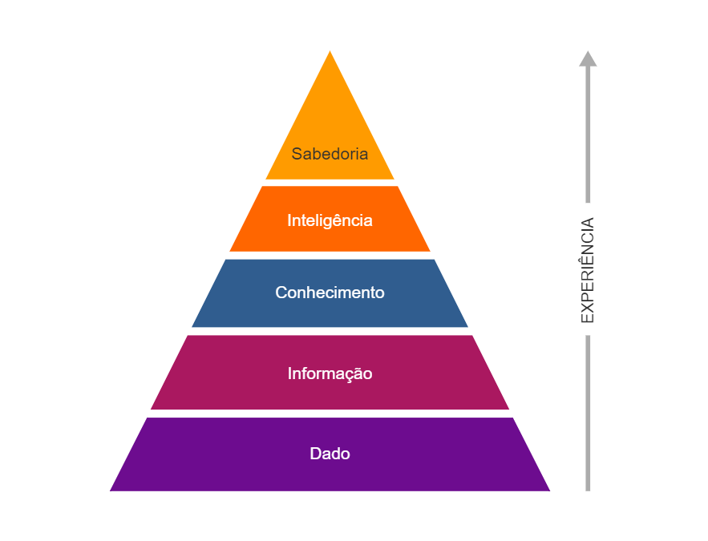
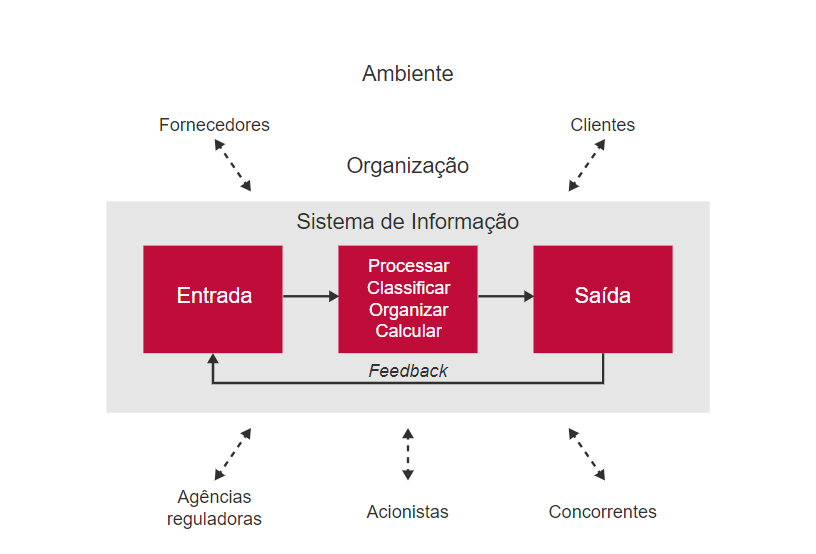

# Capitulo 3

### Significado de Sistemas de Informação

- ### O que é Informação

  - 

  - Começando por baixo...

  - #### Dado

    - O dado é o menor elemento **quantificável**
    - **Quantificável** é tudo aquilo que pode ser enumerado ou medido
      - Idade
      - Salario
      - Data
      - Temperatura
      - Nome
    - Sentimentos como tristeza, felicidade, cansaço não são quantificáveis

  - #### Informações

    - Se adicionarmos um significado a esse dado ele se transforma em uma **informação**
    - Exemplo: 72 Kg é o peso de uma pessoa

  - #### Conhecimento

    - Se adicionarmos um contexto á uma informação ela vira Conhecimento
    - Exemplo: uma criança de 8 anos tem 72Kg

  - #### Inteligência

    - Se temos conhecimento, automaticamente geramos raciocínio.
    - No exemplo acima, existe algo de errado, já que uma criança de 8 anos com 72Kg deve ser obesa
    - O conhecimento, junto com o raciocínio gera inteligência

  - #### Sabedoria

    - Se geramos inteligência e temos experiência de vida, valores morais e éticos podemos gerar sabedoria
    - Com o exemplo acima, podemos constatar que uma criança com essas condições corre riscos e seus pais devem procurar ajuda

- ### O que é um Sistema

  - Um sistema é um conjunto de componente Inter-relacionados que tem um objetivo único
    - Cada componente tem um papel diferente, porem, no final, todos contribuem para um fim comum

- #### O que é sistema de informação

  - É um conjunto de componentes que utiliza informação para atingir um objetivo comum

  - ##### Exemplos

    - E-mail resolve o problema da demora na comunicação
    - WhatsApp resolve o problema do custo com mensagens de texto
    - Skype resolve o problema com os custos de chamadas

  - Note que, nesses exemplos, há pessoas, tecnologia, processos envolvidos

  - Grandes empresas adotam os sistemas de informação como ferramenta gerencial

    

    - O proposito de um sistema é Processar, Classificar, Organizar, Calcular os dados de entrada e gerar uma saída e permitir um feedback
    - Porem, em um ambiente organizacional, as atividades do sistema sofre influencia de diversos fatores, como: fornecedores, concorrentes, acionistas, clientes
      - Cada um desses fatores possui demandas próprias o que acabam moldando como o sistema deve atuar