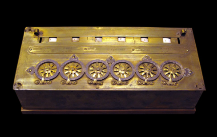
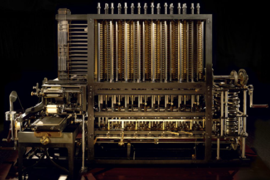
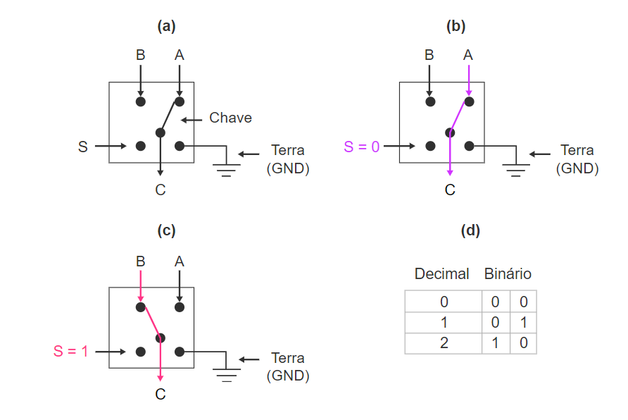
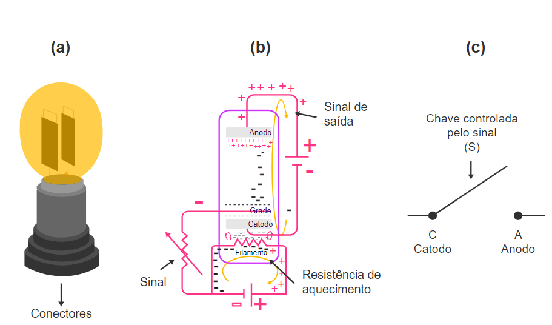
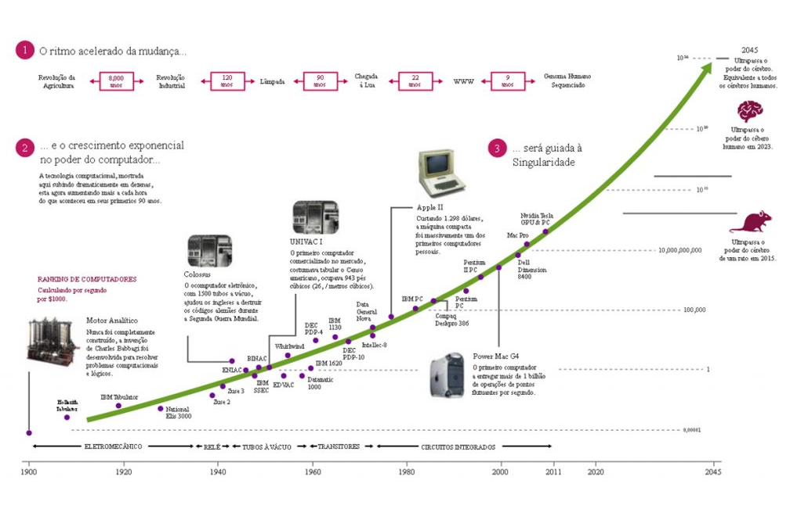
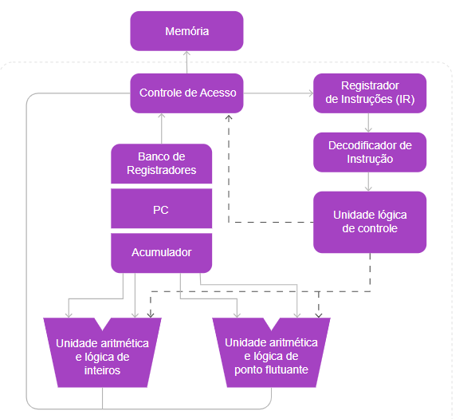

# Capitulo 4

### Software, Hardware e afins

- ### Introdução

  - 
  - Um desenvolvedor deve ser capaz de atuar em todos os vértices desta pirâmide
  - Sendo assim, um Profissional SI deve entender hardware e ser capaz de especificar, instalar e dar suporte
  - Deve ser capaz de desenvolver instalar e dar manutenção no software
  - Assim como, deverá ser capaz de auxiliar as pessoas a usar computadores, oferecendo treinamento e adaptando o soft e o hardware para a necessidade de cada usuário, sendo assim um Peopleware
  
- ### Geração Zero

  - Nesta geração é criada as maquinas de calcular mecânicas

  - #### Maquina de Pascal (Pascalene)

    - 
    - Consistia em 6 engrenagens que armazenavam algarismo de 0 a 9
    - Permitia somar até 3 parcelas de cada vez
    - O resultado não poderia ultrapassar 999.999
    - Uma multiplicação era feita somando o mesmo numero x vezes de acordo com o multiplicador

  - ### Maquina de Babbage

    - Desenvolvida por Charles Babbage
    - Era uma maquina totalmente mecânica
    - Possuía os seguintes fundamentes, que hoje, são encontrados em computadores modernos
      - Alimentação de dados (Através de cartões perfurados)
      - Uma unidade de memoria (No qual os números podiam ser armazenados e reutilizados)
      - Programação sequencias de operações (Um procedimento que hoje chamamos de sistema operacional)
      - 

- ### Eletricidade!!

  - Introduzida inicialmente em computadores mecânicos

  - Com o surgimento dos relês que são interruptores elétricos, houve um avanço na tecnologia

  - O uso dos relês fez com que o desempenho fosse muito maior que as maquinas mecânicas 

  - 

    - (S) a entrada de sinal
    - A e B são entradas de energia que sairão no C
    - Onde a chave encosta é onde será enviada a energia
    - Para trocar a chave basta colocar voltagem no S
    - 
      - Neste exemplo vemos 4 reles, cada par conectado entre si
      - Veja a tabela Verdade, com todas as saídas de acordo com as entradas
      - 

  - #### Computador de Konrand Zuse

    - Foi desenvolvido em 1938 na Alemanha um pouco antes da segunda guerra mundial, conhecida como Z1
    - O programa era lido em uma fita perfurada e os dados eram introduzidos por um teclado numérico
    - Em 1941 o Z3, possuía uma memória que utilizava cerca de 1400 relês e mais 1200 eram utilizados nas unidades de controle e aritmética
    - 

  - #### Maquina de Turing

    - Em 1936, o matemático inglês Alan Turing, desenvolveu a teoria conhecida como máquina universal, que pode modelar qualquer computador digital
    - Essa teoria foi feita graças a maquina criada por ele, responsável por quebrar a criptografia da alemã, Enigma
    - 
    - Turing também participou do projeto Colossus, que foi o primeiro computador 100% eletrônico

- ### Primeira Geração - Válvulas

  - 

- ### Segunda Geração - Transistores

  - Marcando a segunda geração de computadores, os transistores substituíram as válvulas
  - Além de menor e utilizando menos energia, os transistores eram mais fáceis de utilizar pois possuía apenas 3 pinos
  - 

- ### Terceira Geração - Microchip 🟨

  - 

- ### Quarta Geração - maior capacidade de integração de circuitos 🟨

  - 

- ### Quinta Geração - Computadores Modernos

  - Iniciada em 1990 e segue até os dias atuais
  - A quinta geração é marcada por um aprimoramento nas técnicas de integração, fazendo os processadores ficarem menores, mais complexos mais rápidos e baratos, mesmo o componente principal sendo o transistor
  - A técnica utilizada nesta geração é o ULSI (Integração em escala muito alta - Ultra large-scale integration)
  - Desde o inicio na quinta geração até os dias atuais, já houveram diversas mudanças, mas ninguém se arriscou a declarar uma sexta geração
    - Mudanças essas:
      - Múltiplos núcleos
      - processadores de vídeo
      - Muita memoria cache
      - USB, PCI Express etc
    - Surgiram também, para quem trabalha em servidores, os computadores multi-processados, que trabalham com múltiplos processadores ao mesmo tempo

- ### Lei de Moore

  - 
  - Em 1965 0 fundador da Intel, Gordon Earl Moore, observou que o número de transistores de um processador estava crescendo de forma constante, o dobro a cada 18 meses e prévio o crescimento nas próximas décadas

- ### Tipos de computadores

  - Atualmente, vem crescendo cada vez mais a necessidade de digitalização de tudo

  - Sendo para o armazenamento de dados de usuários, até para a autenticação da portaria de um prédio

  - Veja alguns desses computadores:

    - #### Computadores descartáveis

      - É o computador mais simples da atualidade
      - Pode ser utilizado em tags eletrônicas para identificação em portaria, utilizando as ondas de radio, por exemplo
      - possui uma espessura menor de 0,5mm
      - São descartáveis e baratos, 0,5 dólares

    - #### Micro Controladores

      - Encontrados em diversos eletrodomésticos
      - São computadores embarcados, que gerencias por exemplo a interface de um micro-ondas

    - #### Consoles

      - São computadores dedicados a rodar jogos
      - Possuem um hardware especifico para rodar com o máximo do seu potencial os jogos

    - #### PCs

      - São os computadores convencionais encontrado em lares
      - Possui uma configuração de hardware, que atende as necessidades do usuário
      - Possui um sistema operacional complexo

    - #### Servidores

      - Resumidamente é um computador customizado para que seja mais poderoso para suportar o armazenamento e o processamento de dados em grandes volumes
      - Utilizado muito em pequenas e médias empresas

    - #### Clusters

      - Basicamente, clusters, são um grupo de computadores interligados, trabalhando em conjunto para um bem comum
      - Todas executam a mesma tarefa sendo cada conjunto controlado e configurado por software para fim de aumento no nível do processamento e a um custo menor
      - Utilizado muito em grandes sites, como Google ou Facebook

    - #### Mainframes

      - São computadores de grande porte, responsável por processar uma grande quantidade de informação
      - A maioria dos mainFrames não são mais rápidos que servidores
      - Porem, possuem uma grande capacidade de Entrada/Saída e uma capacidade de armazenamento enorme
      - São sistemas muito caros
      - São programados em COBOL
      - São utilizados em bancos e grandes corporações

    - #### Supercomputadores

      - São maquinas extremamente elaboradas e de grande porte
      - Possui CPUs extremamente rápidas
      - Terabytes de memória principal 
      - HDs ou SSDs e placas de redes extremamente velozes
      - São utilizados em sua maioria para resolver problemas de 
        - cálculo de alta complexidade
        - Síntese de novos medicamentes
        - Modelagem aeroespacial
        - Precisão do tempo
        - Previsão de tornados
      - Atualmente o supor computador mais poderoso é o Frontier, um super computador americano

- ### Sistema operacional

  - O sistema operacional tem como função controlar o hardware de forma adequada

  - Podemos definir o SP como um programa que tem a função de gerenciar os recursos do sistema, além de propiciar uma interface para o usuário

  - Além de propiciar a integração de outros softwares como jogos, navegadores, editores de vídeo

  - A maior parte do trabalho do SO são executados em segundo plano, que ficam invisíveis para o usuário

  - As principais responsabilidades do SO são
  
    - Manter os recursos do computador
  - Estabelecer uma interface para o usuário
    - Executar e oferecer recursos para programas que são carregados 

  - #### Karnel
  
    - O Karnel é o núcleo de um SO
    - Tem a função de gerencias todos os recursos do computador e fica gravado na memoria secundaria
    - É responsável pelo controle de todo o SO, e gerencia a memória principal e a secundaria, permitindo carregar algo de uma memória para a outra
  
  - #### Bios
  
    - Conhecido como Basic Input/Output System
    - É um firmware (um software gravado em memória especifica e apenas de leitura - ROM - read only memory)
    - Durante a inicialização do sistema é automaticamente carregado, iniciando alguns testes de componentes
    - É responsável pelo conhecimento do hardware e por carregar o Karnel da memoria secundaria para a primaria
      - Esse sistema é denominado Booting
  
- ### Hardware

  - 

    - #### Processadores

      - Componente cuja função é executar os programas e que pode agregar funções especiais integradas

      - Essas funções integradas serão tratadas melhor no tópico placa mãe

      - Com nome de CPU (Central Unit Processing - unidade central de processamento)

      - É o elemento que realmente executa os programas

        - 

          - **Unidade Lógica de Controle (UC)** Responsável por controlar o acionamento de todas as unidades internas da CPU, de acordo com a instrução que está sendo executada

          - **Unidade Lógica e Aritmética (ULA)** É responsável pela execução das operações aritméticas (soma, subtração) e lógica booleana (AND, OR)  
          - **Registradores** Memórias internas ao processador, usado para armazenar resultados temporários ou controle de informações
          - **Contador de Programa (PC)** Indica o endereço da próxima instrução a ser buscada para ser executada
          - **Registrador de Instrução (IR)** Mantem armazenada, temporariamente, a instrução que esta sendo executada em um determinado momento
          - **Acumulador (ACC)** Armazena um dos valores que serão usados em uma operação logica ou aritmética e após este ser executado, armazena seu resultado
          - **Banco de Registradores** Armazena os registradores usados para empilhamento de valores
          - **Decodificador de Instruções** Analisa a instrução resgatada da memória cache descobrindo a operação que será executada e os valores que serão usados pela mesma e informa isso à UC
          - **Unidade de instruções** Gerencia a troca de valores com a memória cache

      - #### Arquitetura de Processadores

        - #### RISC

          - É uma arquitetura com um conjunto simples de instruções, cada conjunto leva praticamente o mesmo tempo para ser executada
          - Codificação de instruções em uma palavra de tamanho fixo
          - Execução sem microcódigo
          - Altas taxas de execução
          - Altas taxas de execução (1 por ciclo)
          - Poucos modos de endereçamento
          - Operações envolvendo a memória principal restritas a transferência 
          - Operações lógicas e aritméticas entre registradores, com instruções de três endereços

        - #### CISC

          - É um processador capaz de executar centenas de diferentes instruções complexas sendo mais versáteis que as CPUs com tecnologia RISC
          - Possui um conjunto de códigos de instruções que são gravados no processador, chamada micro-programação, que permite receber as instruções dos programas e executá-las, utilizando as instruções contidas na sua micro programação
          - CPUs CISC tem internamente núcleos RISC, sendo assim, a parte CISC do processador cuida das instruções complexas, enquanto o núcleo RISC, cuida das mais simples
          - Atualmente as CPUs são uma fusão das duas tecnologias, chamadas de CPUs híbridas

        - #### Processadores com 2 ou mais núcleos 🟨

          - 

- ### Futuro da Tecnologia - IOT 🟨

  - 

