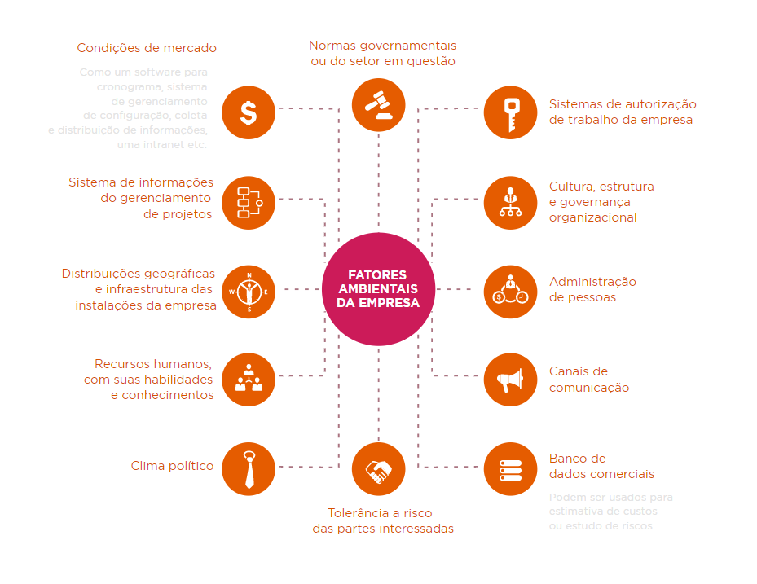

[TOC]

# Capitulo 5 - O que é um projeto

## Introdução

**Tom Peters, considerado referência mundial em Nova Economia, um dia disse:**

> “Se você não investir pelo menos 70% do seu tempo trabalhando em projetos, criando projetos ou 	organizando suas tarefas aparentemente cotidianas em forma de projeto, você está infelizmente vivendo no passado. Atualmente temos que pensar, respirar, atuar e trabalhar em projetos”.

## O que é um projeto

A todo momentos estamos em contato com projetos. Por exemplo: Casamento, Ter Filhos, fazer uma faculdade ou até tirar umas férias no Caribe.

**Mas o que é um projeto afinal?**

De acordo com o **PMBOOK 6ª Edição (2017)**

> **Projeto é um esforço temporário empreendido para criar um produto, serviço ou resultado único.**

### Características obrigatórias de um projeto

- **Deve ser Exclusivo**
  - O produto final deve ser diferente dos similares.
- **Progressivamente Elaborado**
  - Ele deve seguir etapas e ser incrementado à medida do tempo.
- **Propósito e objetivos bem definidos**
  - Precisa ter uma meta principal (entregar o produto pronto)
  - Precisa ter metas intermediárias (Desenvolver o site do produto)
  - Ou até, objetivos secundários (Desenvolver um jogo para acompanhar o produto)
-  **Interdependente**
  - O projeto pode interagir com outro, podendo ser uma parte de um projeto maior
  - Em outro caso, seu produto terá um ciclo de vida em uma linha de montagem
- **Conflito**
  - Geralmente compartilham com outras áreas ou até outros projetos e recursos, que nem sempre estarão disponíveis. Além disso o bem mais precioso são as pessoas, que tem defeitos, limitações e egos diferentes 
- **Sequência de Atividades**
  - Existem diversas atividades conectadas, que devem ser completadas em uma certa ordem, atingindo, no final, o objetivo.
- **Duração Limitada**
  - Todo projeto tem um começo, meio e fim
  - O fim não deve sofrer mudanças e deve ter uma data prevista
  - o Meio pode sofrer mudanças

## Projetos X Operações

Se o trabalho cotidiano não segue as Características de um projeto, trata-se, então, de um trabalho **Operacional**

| **Projeto**                  | **Operação**                        |
| ---------------------------- | ----------------------------------- |
| Estabelecer um novo negócio. | Administrar um negócio consolidado. |
| Construir um aeroporto.      | Operar um terminal aeroportuário.   |
| Construir uma usina nuclear. | Controlar o aquecimento do uranio.  |

Um **projeto** gera um primeiro ou único exemplar de produto, geralmente chamado de protótipo

Já uma **Operação** gera o segundo exemplar em diante, como em uma linha de montagem

| **Projeto**                                                  | **Operação**                                                 |
| ------------------------------------------------------------ | ------------------------------------------------------------ |
| Produto entregue no final.                                   | Produto entregue constantemente e de forma uniforme          |
| Tarefas únicas e inovadoras, gerando um trabalhador versátil e poliglota | Tarefas repetitivo, gerando um trabalhador especializado     |
| Incorpora melhorias ao final do projeto                      | Incorpora melhorias durante a operação, visando qualidade e economia |
| Sincronia mantida com dificuldade, desajustes frequentes, exibindo maior atenção ao planejamento | Sincronia mantida com facilidade, menor atenção ao planejamento |

## Partes Interessadas - STAKEHOLDERS

São todas as partes interessadas ou afetadas direta ou indiretamente pelo projeto, de forma negativa ou positiva.

Podem ser patrocinadores, proprietários, financiadores, governo, vizinho, clientes, funcionários... 

**Exemplo:** Em um projeto de desenvolvimento de um software em uma grande empresa, teríamos, patrocinador, equipe do projeto, departamentos que utilizarão o sistema, fornecedores em caso de terceirização, clientes entre outros

## O que é gerenciamento de projetos

Para que projetos terminem no prazo, com gastos próximos do previsto e contendo tudo aquilo que foi prometido, ele precisa ser bem gerenciado. Assim sendo, precisa de um bom planejamento e uma execução controlada

## Origem das boas Práticas e PMI

No final da década de 1950 começam a surgir padrões de gerenciamento de projetos. como o **CPM** e o **PERT** que foi criado pela marinha dos **EUA**. Essas técnicas foram fundidas posteriormente criando a **PERT-CPM** no inicio da década de 1960, quando se definiu que os projetos deveriam possuir escopo, tempo e custo predeterminados.

No inicio da década de 1980, todas as práticas famosas e aplicadas em empresas, foram reunidas formando assim o **PMBOK**(Project Menagement Body of KnowLedge). Trata-se de um guia de boas praticas, entretanto nem todos seus conhecimentos e práticas devam ser aplicados a todos os projetos, sem ser considerado apropriado para o mesmo

Gerenciar seu projeto traz alguns benefícios, são eles:

- Propósito bem definido
- Escopo claro
- Medições mais Fáceis
- Alocações de recursos humanos mais flexíveis
- Promove a motivação e moral da equipe
- Favorece a capacitação profissional dos recursos
- Mobilidade - O projeto pode ser executado fora do ambiente da empresa

## O que faz um Gerente de Projetos

O **Gerente de projetos** serve para que as boas práticas sejam devidamente aplicadas e que tem uma serie de outras competências. Sua maior especialidade é a resolução de problemas. Embora possa ter habilidades técnicas, não é obrigatório, já que o mesmo contara com especialistas técnicos de sua equipe quando precisar.

### Líder Técnico X Gerente de Projetos

Em diversas empresas um **líder técnico** acaba se tornando um gerente de projetos, porem, em vários casos, não resulta em um bom resultado, pois o **gerente de projetos** necessita de uma série de habilidades que um líder técnico não possui

Algumas dessas habilidades São:

- **Liderança**
- **Comunicação**
- **Elaboração de Orçamento**
- **Planejamento**
- **Aptidões Organizacionais**
- **Negociação e Influencia**
- **Resolução de Conflitos**
- **Formação e motivação de Equipes**

## Ativos de Processos Organizacionais

Ativos, são basicamente, processos, políticas, procedimentos e quaisquer bases de conhecimentos utilizadas pela empresa. Qualquer conhecimento, prática ou artefatos, de todas as organizações envolvidas que possam ser úteis para executar ou administrar o projeto.

São extremamente uteis como parâmetro para se identificar que estratégia pode dar certo ou errado.

**Os ativos de processos organizacionais podem ser agrupados em duas categorias:**

### Processos e Procedimentos

- Padrões/politicas de segurança, projetos e políticas de procedimentos de qualidade, listas de verificação, metas, entre outros.
- Diretrizes padronizadas e critérios de medição de desempenho e de avaliação de propostas.
- Modelos, como de risco, EAP/WBS e diagrama de redes para cronogramas.
- Procedimentos de controles financeiros: relatórios de horas, análises de gastos, entre outros.
- Procedimentos de controle de mudanças de projeto.
- Diretrizes de encerramento de projeto: auditorias finais do projeto, avaliações, validações e critérios de aceitação de produto

### Base de Conhecimento

- Arquivos de projetos anteriores: linhas de vase para escopo, custo, cronograma de qualidade, cronograma de projeto e registro de riscos com suas ações e respostas planejadas
- Banco de dados de gerenciamento de configuração contendo as linhas de base de todos os padrões, politicas e procedimentos necessários para oficializar um projeto na empresa
- Bases de conhecimento de informações históricas e lições aprendidas
- Banco de dados financeiros contendo informações como: Custos pessoa/hora, custos incorridos, orçamentos e outros dados financeiros

## Fatores Ambientais da Empresa

Trata-se das condições oferecida pela empresa que influenciam o projeto de alguma maneira. Podendo tanto aumentar, quanto diminuir as opções de gerenciamento, influenciando muito o projeto

**Algumas dessas condições são:**

## Processos de Gerenciamento de Projetos

Um processo é um conjunto de atividades, que quando cumpridas na ordem apropriada, atingem um objetivo predefinido. Cada processo tem entradas que são os artefatos necessários à sua execução. Técnicas e ferramentas são usadas na execução do processo, resultando, como saída, artefatos que eram seus respectivos objetivos

Para ser bem-sucedida, a equipe do projeto deve selecionar e executar os processos apropriados para cumprir os objetivos do projeto. Geralmente, podem ser classificados como:

**Processos De Gerenciamento de Projetos**

- Focados em Gerenciamento, utilizados para conduzir de maneira eficaz o projeto, além de abranger as ferramentas e técnicas que serão descritas nas áreas do conhecimento

**Processos Orientados a produtos**

- Definido pelo ciclo de vida do projeto e variando de acordo com a área de aplicação

- **Exemplo:** Para se construir uma casa, são necessárias técnicas e ferramentas especificas para o mesmo.

### Grupos de processos

Processos são considerados **boas praticas**, pois é consenso que a aplicação deles aumenta a eficiência e as chances de sucesso.

Porem não significa que todos os processos devem ser aplicados, o Gerente de projetos com a colaboração da equipe, sempre é responsável por determinar quais processos são prioritários.

**Alguns desses Grupos de processos:**

- **Inicialização** 
  - Processos que devem ser executados na definição de um novo projeto
- **Planejamento**
  - Processos necessários para definir o escopo do projeto, e como alcançar o objetivo pelo qual o projeto foi criado
- **Execução**
  - Processos necessários para executar o trabalho e satisfazer as especificações do projeto
- **Monitoramento e controle**  
  - Processos exigidos para controlar o progresso e o desempenho do projeto
- **Encerramento**
  - Processos para se finalizar o projeto ou fase do projeto

Os Grupos de processos são vinculados pelas saídas que produzem. Raramente são distintos ou ocorrem uma única vez. Trata-se de atividades sobrepostas e podem ocorrer diversas vezes ao longo do projeto

- Percebe-se que o Processo de planejamento e execução entram em um ciclo, até que o projeto esteja pronto, enquanto isso, eles tem um pico no meio do projeto

- Enquanto o de inicialização e encerramento, tem um pico em suas extremidades do gráfico
- E o processo de Monitoramento, tem uma leve elevação no meio, mas esta presente no projeto do inicio ao fim

Isso colabora com a imagem do ciclo de vida do uso de processos:

## Áreas de Conhecimento

Os processos processos de gerenciamento podem ser agrupados em 10 áreas do conhecimento distintas. Cada área representa um conjunto de conceitos, termos e atividades associados a um campo profissional ou área de especialização. São utilizados em boa parte dos projetos para atingir seus objetivos

**Integração**

- Processos e atividades para identificar, definir, combinar, unificar e coordenar os vários processos e atividades dentro dos grupos de processos de gerenciamento do projeto

**Escopo**

- Processos para assegurar que o projeto inclui todo o trabalho necessário e apenas o essencial para terminá-lo com sucesso

**Cronograma**

- Processos para gerenciar o término pontual do projeto

**Custo**

- Processo que envolve planejamento, estimativas, orçamentos, financiamento, gerenciamento e controle de custos com o objetivo de terminar o projeto dentro do orçamento

**Qualidade**

- Processo para incorporação da politica de qualidade da organização com relação ao planejamento e do produto, para que possa atender as expectativas

**Recursos**

- Processos para identificar, adquirir e gerenciar os recursos necessários para a conclusão bem-sucedida do projeto

**Comunicações**

- Processos para assegurar que as informações do projeto sejam, coletadas e distribuídas de forma apropriada

**Riscos**

- processos de condução de planejamento, identificação e análise de gerenciamento de risco, planejamento de resposta, implementação de resposta e monitoramento de risco em um projeto

**Aquisições**

- processos necessários para comprar ou adquirir produtos, serviços ou resultados externos à equipe do projeto

**Partes Interessadas**

- processos exigidos para identificar as pessoas, grupos ou organizações que podem impactar ou serem impactados pelo projeto, analisar as expectativas das partes interessadas e seu impacto no projeto e desenvolver estratégias de gerenciamento apropriadas para o seu engajamento eficaz nas decisões e execução do projeto